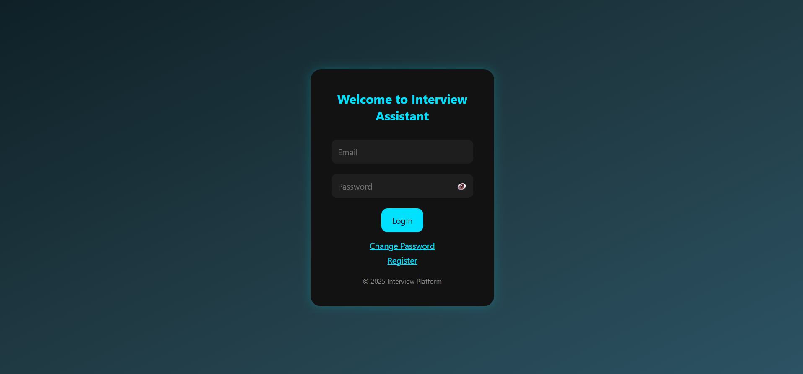
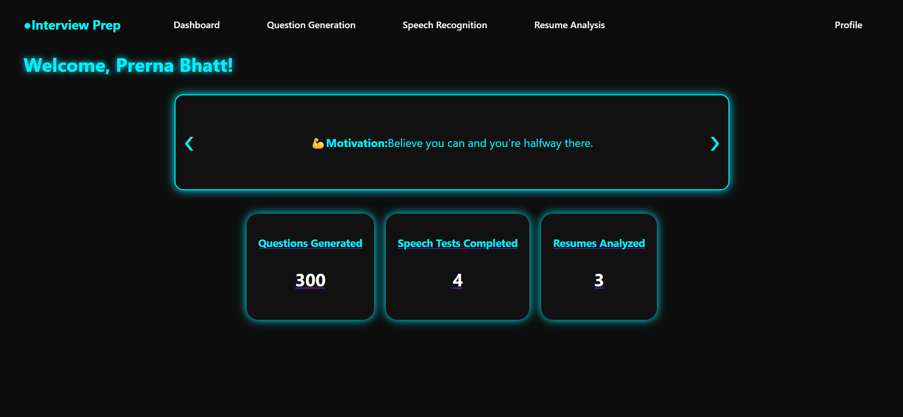
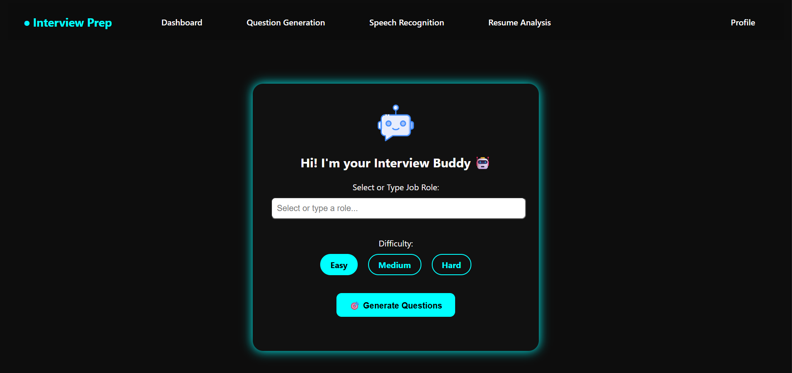
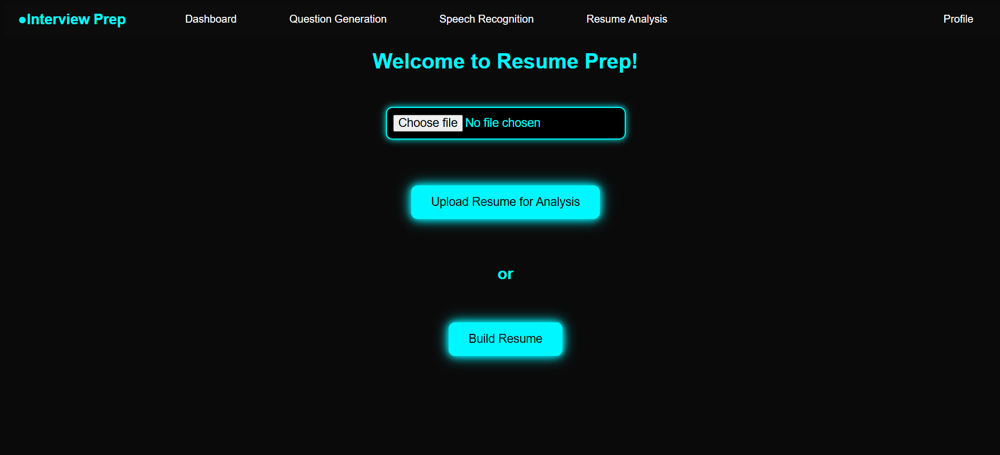
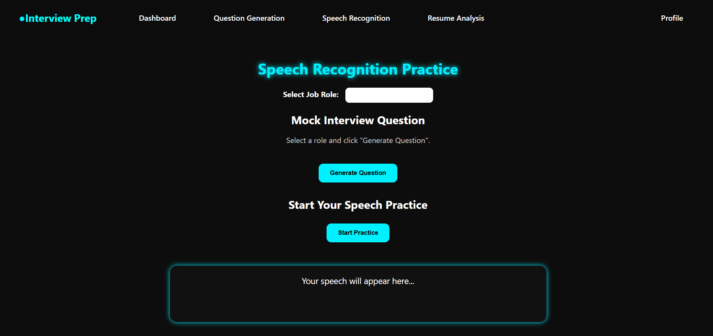

# 📘 Interview Preparation Platform

An offline, responsive platform built using **HTML, CSS, JS, PHP & MySQL (XAMPP)** to help users prepare for interviews.  
Features include login system, resume builder, quiz practice, and progress tracking.

---

## 🚀 Features

- 🔐 User registration & login authentication  
- 📄 Resume builder tool  
- 🧠 MCQ-based interview quizzes  
- 📊 User progress tracking  
- ⚙️ Admin section (optional)  
- 💡 Responsive and user-friendly UI

---

## 🔧 Tech Stack

- **Frontend**: HTML, CSS, JavaScript  
- **Backend**: PHP  
- **Database**: MySQL (via phpMyAdmin)  
- **Local Server**: XAMPP  
- **Tools Used**: VS Code, phpMyAdmin

---

## 💻 How to Run Locally

1. **Install XAMPP** from [apachefriends.org](https://www.apachefriends.org/)
2. **Clone or download** this repository
3. Move the project folder to: C:\xampp\htdocs\interview-preparation-platform

4. Open **phpMyAdmin**, create a new database (e.g., `interview_db`)
5. **Import** the provided `database.sql` file into the new DB
6. Start **Apache** and **MySQL** from XAMPP Control Panel
7. Open your browser and go to: http://localhost/interview-preparation-platform

## 📸 Screenshots

### 🔐 Login Page  

### 📊 Dashboard  

### ❓ Quiz Section  

### 📄 Resume Builder  

### 🗣️ Speech Page  

---

## 🙋‍♀️ Author

**Prerna Bhatt**  
📧 bhattprerna673@gmail.com  
🔗 [LinkedIn](https://linkedin.com/in/prerna-bhatt-853a32252)  
🔗 [GitHub](https://github.com/bhattprerna)

---

## 📝 License

This project is licensed under the MIT License.  
See the [LICENSE](LICENSE) file for details.
